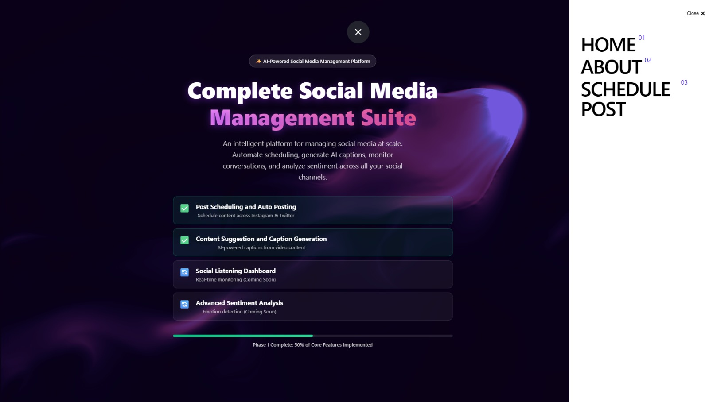
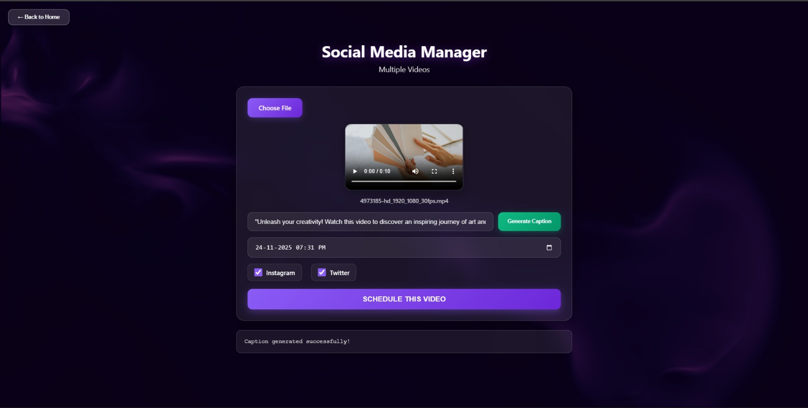

# 🚀 PostAura – Complete Social Media Management Suite

PostAura is an all-in-one **AI-powered platform** designed to automate and manage social media at scale.  
It enables scheduling posts, generating captions using AI, analyzing trends, and more — all from one dashboard.

---

## 🏠 Screenshots

### Home Page  


### Schedule Post Page  


---

## 🌟 Features

| Feature | Status |
|--------|--------|
| Auto Post Scheduling (Instagram + Twitter) | ✅ Completed |
| AI-Powered Caption Generator | ✅ Completed |
| Content Suggestion from Video | 🟢 Phase 1 Completed |
| Social Listening Dashboard | 🔜 Coming Soon |
| Advanced Sentiment Analysis | 🔜 Coming Soon |

---

## 🧰 Tech Stack

### 🖥 Frontend
- React.js
- Tailwind CSS
- Framer Motion (Animations)
- Axios (API Requests)

### ⚙️ Backend
- Node.js
- Express.js
- MongoDB / Mongoose
- JWT Authentication

### 🤖 AI & Automation
- OpenAI Vision/Text APIs for caption generation
- FFmpeg for video frame processing (if used)
- Cron Jobs / Queue for scheduled posting

---

## ⚡ Setup Guide (Run Locally)

### 1️⃣ Clone the Repository
```bash
git clone https://github.com/SaaiM2005/PostAura.git
cd PostAura
